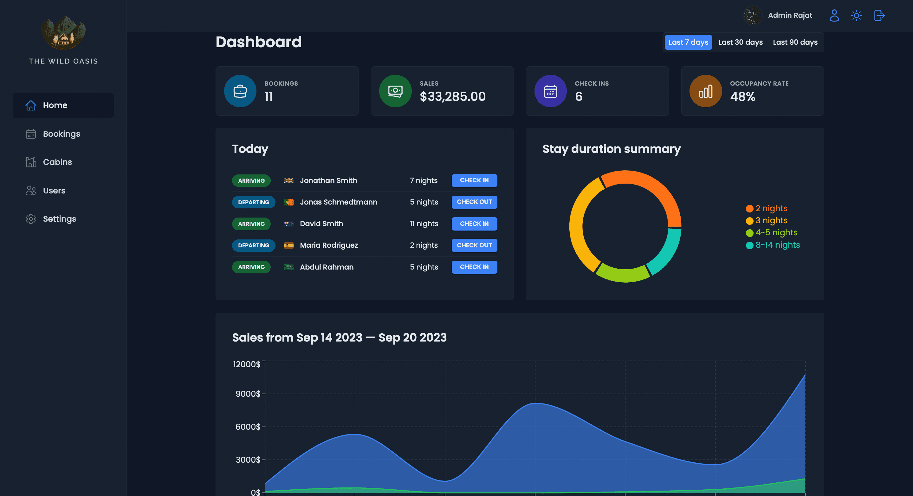
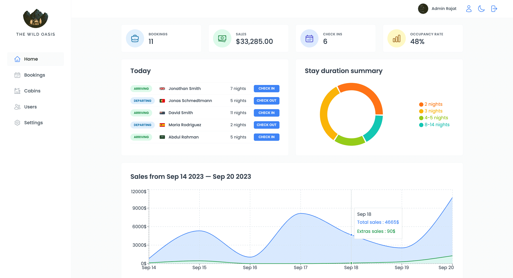
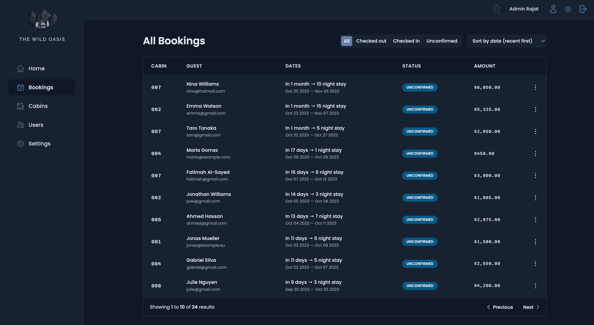
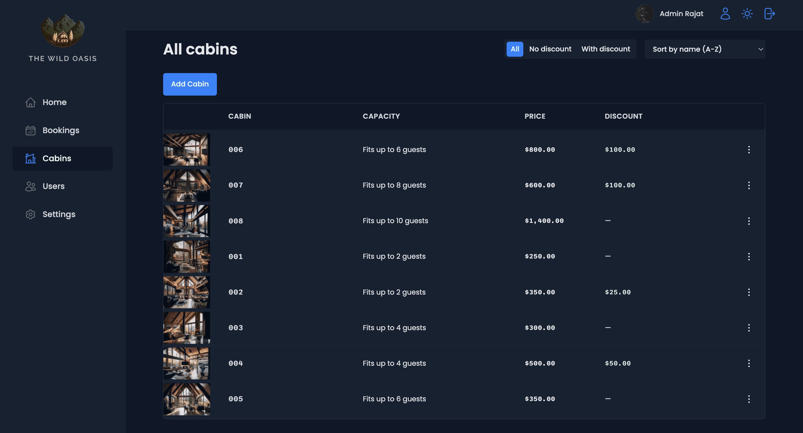
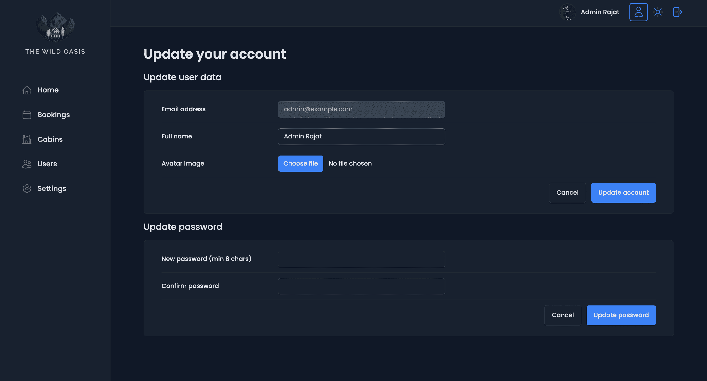

# The Wild Oasis

## [Click to see live demo](https://the-wild-oasis-react.vercel.app/)

## Test Account Credentials

-   Email Address : `admin@example.com`
-   Password : `admin@example`

---

## Tech Stack

&nbsp;&nbsp;
&nbsp;&nbsp;
&nbsp;&nbsp;
&nbsp;&nbsp;
&nbsp;&nbsp;
&nbsp;&nbsp;
&nbsp;&nbsp;
&nbsp;&nbsp;

---

## Screenshots

-   ### `Dashboard Dark Mode`

    

-   ### `Dashboard Light Mode`

    

-   ### `Bookings Page`

    

-   ### `Cabins Page`

    

-   ### `User Account Page`

    

## Features

-   **`The Wild Oasis`** is an admin dashboard for a Hotel Cabins.
-   Users of the **`Web App`** are the hotel employees.
-   It has a login page with email and password authentication using **`Supabase`**.
-   It has a dashboard page with a sidebar and a navbar.
-   The sidebar has links to the dashboard, bookings, rooms, customers, and staff pages.
-   The dashboard page has a summary of the total number of bookings, rooms, customers, and staff.
